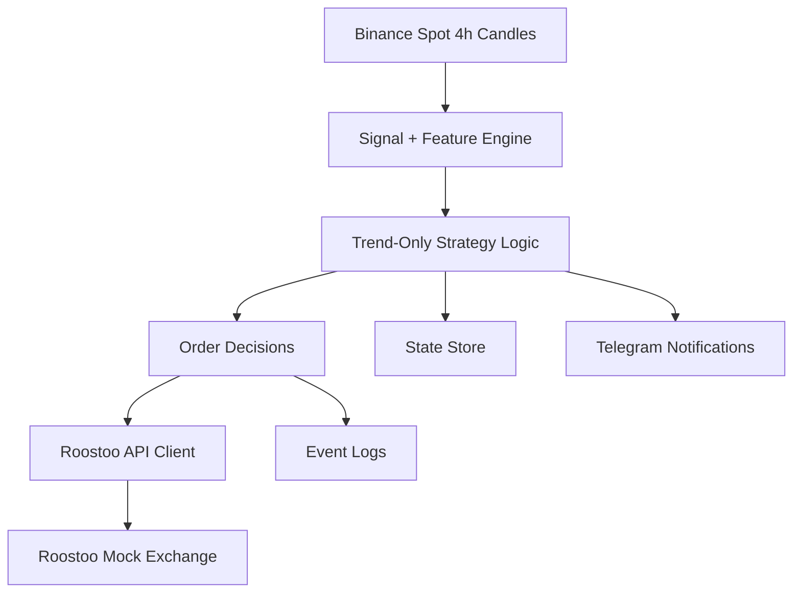

# Roostoo Competition Bot

## Project Overview

This repository contains a long-only crypto trading bot built for the Roostoo AI Web3 Trading Bot Competition.

The current main strategy is the **4-hour trend-following breakout system** researched in [trend_strat.ipynb](C:/Users/calde/OneDrive/Documents/Roostoo-trading-competition/trend_strat.ipynb).

High-level idea:

- use Binance spot candles for signal generation
- rank a fixed universe of liquid crypto names by relative strength
- only buy names already above trend and breaking out
- scale into winners in tranches
- exit when structure breaks, stop logic triggers, trailing stop fails, or the hold window expires

Key features:

- deterministic rule-based strategy
- fully bar-close driven, not HFT or market-making
- signed Roostoo REST integration for account and execution
- local persistent state for restart safety
- append-only logs for auditability
- paper-mode support for safe testing

## Architecture

### System Flow



### Components

- `roostoo_bot/clients/binance.py`
  Fetches Binance spot OHLCV data and maintains the local candle cache.
- `roostoo_bot/clients/roostoo.py`
  Handles signed Roostoo REST requests for balances, pending orders, symbol info, and order placement/cancel.
- `roostoo_bot/strategy/trend_only.py`
  Implements the 4h trend-following breakout logic and generates entry/add/exit instructions.
- `roostoo_bot/bot.py`
  Orchestrates the live bot cycle: refresh data, detect new bar, run strategy, execute orders, persist state, and log outcomes.
- `roostoo_bot/storage/`
  Stores bot state and candle cache locally.
- `roostoo_bot/notifications/telegram.py`
  Sends operational alerts and scan summaries to Telegram.
- `scripts/run_once.py`
  Runs one decision cycle for testing.
- `scripts/run_bot.py`
  Runs the continuous bot loop.
- `scripts/check_roostoo.py`
  Read-only Roostoo connectivity/account diagnostic.

### Tech Stack

- Python 3.12
- `pandas`, `numpy`, `requests`
- Jupyter notebooks for research
- Binance public REST market data
- Roostoo mock exchange REST API
- local JSON / JSONL / CSV persistence

## Strategy Explanation

### Universe

The current trading universe is:

- `BTCUSDT`
- `ETHUSDT`
- `SOLUSDT`
- `XRPUSDT`
- `BNBUSDT`
- `DOGEUSDT`
- `AVAXUSDT`
- `ADAUSDT`
- `LINKUSDT`
- `SUIUSDT`
- `FETUSDT`

Maximum concurrent open positions:

- `MAX_OPEN_POSITIONS = 5`

### Entry Conditions

Signals are evaluated only on completed **4-hour candles**.

A symbol is eligible for entry when all of the following are true:

- `close > breakout_high`
- `close > ema20`
- `ema20_slope > 0`

Eligible names are ranked by cross-sectional relative strength using recent momentum.

### Exit Conditions

Exits are evaluated in this order:

- structure break: `close < ema20` or `close < exit_low`
- stop exit: `close <= stop_price`
- trailing stop exit: `close <= peak_close * (1 - trailing_stop_pct)`
- max hold exit: `hold_bars >= max_hold_bars`

### Position Sizing

Position sizing is stop-based:

- risk budget per trade = `equity * RISK_PER_TRADE`
- target notional is clipped by stop distance and `MAX_POSITION_NOTIONAL_PCT`
- entries are split into tranches

### Current Live Candidate Configuration

The current live candidate keeps the same underlying trend-following logic, but uses a slightly less conservative holding profile than the original baseline:

- `breakout_lookback = 4`
- `exit_lookback = 6`
- `max_hold_bars = 54` (roughly 9 trading days on 4h bars)
- `trailing_stop_pct = 0.08`
- `tranche_scheme = (0.35, 0.35, 0.30)`
- `use_btc_filter = False`
- `risk_per_trade = 0.015`

This version is intended as a middle ground:

- faster breakout confirmation than the original 6-bar entry
- a wider trailing stop to reduce noise exits
- a longer maximum hold window so strong trends are not cut too early

### Risk Management

- max 5 open positions
- capped per-position notional
- no leverage
- no short selling
- exits are processed before adds and new entries
- bot persists state after each completed cycle

### Assumptions

- market data comes from Binance spot, not Roostoo candles
- execution happens on Roostoo mock exchange
- live behavior approximates "evaluate shortly after 4h bar close"
- transaction costs matter, so `5 bps` to `10 bps` scenarios are more informative than frictionless backtests

## Research / Backtest Summary

Main research notebook:

- [trend_strat.ipynb](C:/Users/calde/OneDrive/Documents/Roostoo-trading-competition/trend_strat.ipynb)

Current interpretation:

- the strategy is materially stronger than equal-weight buy-and-hold on a risk-adjusted basis
- the selected configuration remains positive out of sample after costs
- drawdown stays controlled because the strategy is selective and often underinvested

This repository also includes other research notebooks, but the trend-only notebook remains the core strategy research reference for the live bot.

## Setup Instructions

### Recommended: `venv` + `requirements.txt`

For a hackathon / judging workflow, plain `venv` is the simplest setup.

1. Create a virtual environment:

```bash
python -m venv .venv
```

2. Activate it.

Windows PowerShell:

```bash
.venv\Scripts\Activate.ps1
```

Windows CMD:

```bash
.venv\Scripts\activate.bat
```

Linux / WSL:

```bash
source .venv/bin/activate
```

3. Install dependencies:

```bash
pip install -r requirements.txt
```

4. Copy the env template:

```bash
copy .env.example .env
```

5. Fill in:

- `ROOSTOO_BASE_URL`
- `ROOSTOO_API_KEY`
- `ROOSTOO_API_SECRET`
- `TELEGRAM_TOKEN`
- `TELEGRAM_CHAT_ID`

### Optional: Poetry

Poetry is supported, but optional:

```bash
poetry install
```

The default repository workflow is standard `venv + pip`.

Telegram command responsiveness is controlled separately:

- `POLLING_SECONDS` controls market-data / strategy polling
- `TELEGRAM_POLL_SECONDS` controls how often `/help`, `/account`, etc. are checked

## Tests

Run the automated test suite with:

```bash
python -m pytest tests -q
```

Current coverage includes:

- config parsing
- strategy entry / add / exit behavior
- BTC filter behavior
- Roostoo signed-request logic
- paper-mode bot cycle smoke test

## How To Run The Bot

### 1. Verify Roostoo connectivity

Read-only diagnostic:

```bash
python scripts/check_roostoo.py
```

### 2. Run a single strategy cycle

Useful for testing signal generation, state updates, and logging without running forever:

```bash
python scripts/run_once.py
```

### 3. Run the continuous bot

```bash
python scripts/run_bot.py
```

When Telegram is configured, the running bot also responds to:

- `/help`
- `/ping`
- `/account`
- `/wallet`
- `/orders`
- `/positions`
- `/state`
- `/config`

### 4. Switch between paper and live mode

In `.env`:

```env
LIVE_TRADING=false
```

Use `false` for safe testing. Only switch to `true` once account queries and order payloads are fully validated.

## Runtime Outputs

Generated files:

- `outputs/bot_state.json`
  Persistent state for open positions, equity, cash, and last processed candle timestamp.
- `outputs/events.jsonl`
  Append-only trading decision log.
- `outputs/heartbeat.jsonl`
  Append-only health log for cycle execution.
- `outputs/candle_cache/*.csv`
  Local Binance candle cache by symbol.

## Notes For Judges

- The bot is deterministic and bar-close driven.
- No manual trades are required for the strategy logic to operate.
- The repository includes both research artifacts and runnable execution code.
- Roostoo API integration uses the documented signed-request format.
- The default repository setup path is standard `venv + pip` for reproducibility.
